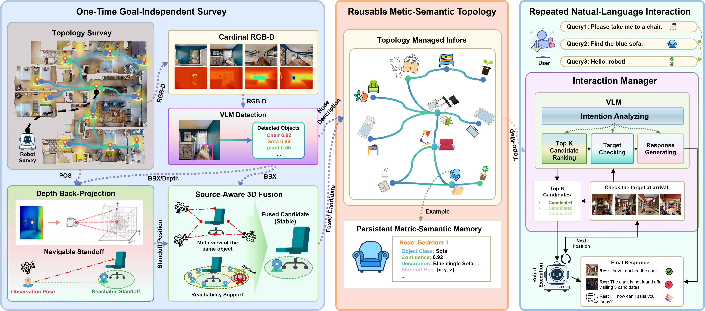
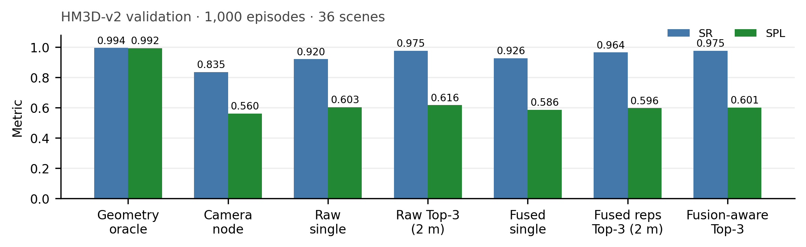

# SSTG-Nav

## Metric-Grounded Spatial-Semantic Topological Graphs for Reusable Object Navigation

This repository provides the public benchmark implementation accompanying the SSTG-Nav paper. It supports reproducible evaluation of reusable Object Navigation in pre-explored environments using Habitat and HM3D.

SSTG-Nav converts a one-time, goal-independent RGB-D survey into a persistent metric-semantic topology. Visual detections are grounded into reachable object-centric standoffs, consolidated across viewpoints, and reused for subsequent natural-language navigation requests.

<p align="center">
  
</p>

## Benchmark Scope

The public implementation includes:

- goal-independent topological map construction;
- calibrated RGB-D capture and metric object grounding;
- source-aware 3D and reachability-based fusion;
- reusable candidate retrieval and graph planning;
- fusion-aware sequential candidate recovery;
- SR, SPL, DTG, and arrival-verification evaluation;
- reproducibility scripts, tests, and supplementary artifacts.

The benchmark uses the HM3D ObjectNav-v2 validation split. The main evaluation contains 1,000 episodes across 36 scenes.

## Main Results

<p align="center">
  
</p>

| Method | SR | SPL |
|---|---:|---:|
| Camera-node baseline | 0.835 | 0.560 |
| Metric-grounded RGB-D | 0.920 | 0.603 |
| Source-aware 3D fusion | 0.926 | 0.586 |
| Fusion-aware Top-3 recovery | **0.975** | **0.601** |

The geometry-oracle result shown in the figure is an evaluator-labeled coverage ceiling. System results use goal-independent topologies constructed without ObjectNav goals.

## Installation

Create the Habitat benchmark environment:

```bash
conda env create -f environment.yml
conda activate sstg-nav-bench
export PYTHONPATH="$PWD"
```

Local vision-language model controls use the optional environment:

```bash
conda env create -f environment-vlm.yml
```

Configure the HM3D and ObjectNav-v2 paths in [`configs/minival.yaml`](configs/minival.yaml). The expected default layout is:

```text
data/
├── hm3d/
└── datasets/objectnav_hm3d_v2/
```

## Quick Start

Run the goal-independent minival pipeline:

```bash
./run_uniform_minival.sh
```

Run the full RGB-D benchmark pipeline:

```bash
./tools/run_full_rgbd_benchmark.sh
```

The complete stage definitions and experiment commands are documented in [`docs/core-pipeline.md`](docs/core-pipeline.md).

## Repository Structure

| Path | Description |
|---|---|
| [`sstg_bench/`](sstg_bench/) | Mapping, RGB-D grounding, fusion, retrieval, recovery, and evaluation |
| [`configs/`](configs/) | Benchmark configurations |
| [`tools/`](tools/) | Reproduction, visualization, packaging, and validation utilities |
| [`tests/`](tests/) | Metric, ranking, grounding, and arrival-verifier tests |
| [`docs/core-pipeline.md`](docs/core-pipeline.md) | Protocol and pipeline documentation |
| [`supplementary/`](supplementary/) | Paper supplement and machine-readable evidence package |

## Verification

```bash
PYTEST_DISABLE_PLUGIN_AUTOLOAD=1 PYTHONPATH=. pytest -q
python tools/validate_release.py
python supplementary/verify_technical_supplement.py supplementary
```

## Release Scope

This repository contains the publicly releasable SSTG-Nav benchmark and evaluation implementation. The complete robot-deployment stack and project-specific system-integration code will not be released because they are subject to confidentiality obligations associated with collaboration with Huawei.

## Citation

Citation information will be added after publication.
