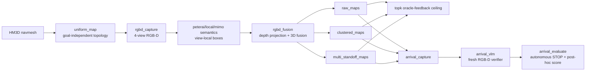

# SSTG-Nav Bench 核心流水线

本文说明代码当前实现的模块边界、地图产物、分层候选规则和评测协议。主结果与数字仍以仓库根目录的 [`README.md`](../README.md) 为准；本文用于复现和扩展实验。

## 数据流



流水线刻意分成 Habitat 侧和 VLM 侧。建图、深度反投影、navmesh snap、路径和指标必须在 Habitat Python 中运行；远程 API 或本地 Qwen 推理使用通用/VLM Python。所有命令都应从仓库根目录执行并设置 `PYTHONPATH=$PWD`。

## 环境边界

| 阶段 | 推荐解释器 | 主要依赖 |
|---|---|---|
| topology、capture、fusion、evaluation、visualization | `environment.yml` / Python 3.9 | Habitat-Sim 0.3.3、NumPy `<2` |
| Qwen2.5-VL 本地推理 | `environment-vlm.yml` / Python 3.10 | PyTorch、Transformers、qwen-vl-utils |
| PeterAI hosted inference | `GENERAL_PYTHON` | `requests` |

推荐设置：

```bash
export PYTHONPATH=$PWD
export HABITAT_PYTHON=/home/daojie/anaconda3/envs/habitat/bin/python
export GENERAL_PYTHON=python
```

PeterAI key 从环境变量 `PeterAI_KEY` 读取；未设置时，相关模块按 `--env` 指定路径读取。默认路径是相对仓库根目录的 `../.env`。`.env`、原始数据和实验输出已在 `.gitignore` 中排除。

## 核心阶段与产物

### 1. Annotation-independent topology

`sstg_bench.uniform_map` 从 navmesh 的随机可导航点池做 greedy farthest-point sampling。采样不读取 ObjectNav goal annotation；输出中 `sampling.goal_annotations_used` 固定为 `false`。

主要产物：

- `<output>/<scene>/vlm_topological_map.json`：拓扑节点、scene-local 边和采样元数据。
- `<output>/<scene>/topology.png`：人工检查用 top-down preview。
- `<output>/sampling_report.json`：scene 数、节点数、边数和经验覆盖半径。

### 2. RGB-D capture 与语义定位

`sstg_bench.rgbd_capture` 在每个拓扑点采四个 cardinal views，保存 RGB、浮点深度、相机朝向、分辨率和 FoV。主实验使用 `640×640`、HFOV 120°。

`peterai_rgbd_semantics`、`mimo_rgbd_semantics` 或 `local_rgbd_semantics` 接收四张独立视图，输出：

```json
{
  "view_index": 0,
  "category": "chair",
  "bbox_norm": [0.12, 0.21, 0.68, 0.94],
  "confidence": 0.93
}
```

坐标以单张图归一化到 `[0,1]`。兼容模型若返回 `[0,1000]` grounding 坐标，parser 会先归一化。Hosted inference cache 记录 model、prompt/parser version、wire API、原始响应、token usage 和 latency；满足相同实验身份的成功响应可断点复用。

### 3. Depth grounding 与 3D fusion

`sstg_bench.rgbd_fusion` 在检测框中心的 `7×7` patch 中取有效深度中位数，将图像点反投影到世界坐标，再沿相机到物体的水平观察方向构造默认 0.8 m standoff 并 snap 到 navmesh。不可用深度、无方向的近零向量和不可达 snap 会被丢弃。

同类候选只有同时满足以下条件才会 union：

- 物体估计的水平距离不超过 `--cluster-radius`（默认 1.2 m）；
- 垂直差不超过 `--vertical-tolerance`（默认 1.0 m）；
- 两个停止点可达，且 navmesh 距离不超过 `--max-stop-geodesic`（默认 3.0 m）。

每个 cluster 的 `cluster_support` 是独立来源拓扑点数，不是检测框数。`category_scores` 使用每个来源的最高置信度计算 noisy-OR，避免同一来源的重复框虚增证据。

一次运行输出三类地图：

| 子目录 | 节点保留规则 | 典型用途 |
|---|---|---|
| `raw_maps/` | 每个有效深度候选各保留一个节点 | 原始表示、最大恢复多样性 |
| `clustered_maps/` | 每个通过 support/confidence gate 的 cluster 只保留最高置信节点 | 压缩地图、稳定 primary |
| `multi_standoff_maps/` | 对每个保留 cluster 保存它的全部成员停止点，并共享 cluster score/support | 保留融合语义与多停止侧几何 |

`fusion_report.json` 同时报告 `raw_candidates`、`fused_candidates` 和 `fused_standoff_candidates`。注意 `multi_standoff_maps/` 不包含被 fusion gate 整簇丢弃的 raw 候选，因此它不是 `raw_maps/` 的简单改名。

## 分层 Top-K 候选

`sstg_bench.topk` 支持一至三层候选源：

1. `--primary-maps`：先选 `--primary-k` 个，固定按 `category_score` 排序；主实验使用一个 fused representative。
2. `--secondary-maps`：可选，再选 `--secondary-k` 个，按 `--secondary-ranking-strategy` 排序。
3. `--maps`：用 `--ranking-strategy` 排序并填满剩余的 `--max-k` 名额。

排序键如下；每个键最后都用 episode 起点到候选的 geodesic distance 打破平局：

| 策略 | 优先级 |
|---|---|
| `category_score` | category score → distance |
| `support_confidence` | cluster support → node confidence → distance |
| `confidence_support` | node confidence → cluster support → distance |

候选逐层追加；新节点与任一已选节点的欧氏距离小于 `--min-separation` 时会被跳过。该距离用于假设多样性，不替代 Habitat 的 geodesic 路径规划。节点 `id` 只在单 scene、单地图目录内唯一；跨层比较必须使用位姿或显式来源字段。

论文 headline 的两层策略为：

```text
clustered_maps (primary-k=1, category_score) → raw_maps (confidence_support)
```

它由 `tools/run_full_rgbd_benchmark.sh` 复现。`multi_standoff_maps/` 和 secondary tier 是代码已支持的候选设计诊断，不自动替换论文 headline。

### 三层诊断示例

下面的命令先选一个 fused representative，再选一个 raw standoff，最后从 retained multi-standoff 中补齐 Top-3：

```bash
$HABITAT_PYTHON -m sstg_bench.topk \
  --split val --scene-dir val --max-k 3 --min-separation 2.0 \
  --primary-maps outputs/hm3d_val_uniform/gpt54_rgbd_wide120_fusion/clustered_maps \
  --primary-k 1 \
  --secondary-maps outputs/hm3d_val_uniform/gpt54_rgbd_wide120_fusion/raw_maps \
  --secondary-k 1 --secondary-ranking-strategy confidence_support \
  --maps outputs/hm3d_val_uniform/gpt54_rgbd_wide120_fusion/multi_standoff_maps \
  --ranking-strategy confidence_support \
  --output outputs/hm3d_val_uniform/diagnostic_fused_raw_multi_top3
```

输出的 `summary_topk.json` 会记录所有候选源、排序策略、K、最小间距和每个 prefix 的 SR/SPL；`episodes_topk.csv` 保存逐 episode 尝试与累计路径。

`arrival_capture` 当前支持 `primary → fallback` 两层，不接受 `--secondary-maps`。使用 primary map 时，它给 fallback 的 scene-local `id` 加 `100000` 偏移，防止 capture/verifier cache key 与 primary 节点碰撞。若要把三层诊断接入自主 STOP 流程，需要先同步扩展 `arrival_capture.ranked_candidates` 和 capture report，不能只复制 `topk.py` 的数字。

## 评测协议

| 模块 | 候选选择时读取官方 goal | 到达后读取官方 goal | 结果含义 |
|---|---:|---:|---|
| `uniform_map` / `rgbd_capture` / semantic / `rgbd_fusion` | 否 | 否 | goal-independent pre-map |
| `experiments`（VLM maps） | 否 | 是 | 单候选 post-hoc benchmark |
| `experiments`（oracle backend） | 是；节点来自官方 goal viewpoints | 是 | privileged coverage control |
| `topk` | 否 | 每次候选后读取 | oracle-feedback candidate-list ceiling |
| `arrival_capture` / `arrival_vlm` | 否 | 否 | 可部署的候选采集与 STOP 信号 |
| `arrival_evaluate` | 否；STOP 由冻结 verifier 响应控制 | 决策后读取 | 自主 STOP 的 post-hoc SR/SPL |

官方成功条件是停止点到任一同类官方 goal viewpoint 的 navmesh 距离不超过 1 m。代码计算 `SPL = S × L / max(L, P)`：`L` 是 episode 官方最短距离，`P` 是实际访问候选的累计 geodesic 距离。

不要混用以下数字：

- `topk` 的 Success@K 假设 evaluator 在每次访问后告诉 agent 是否成功，是诊断上限。
- `arrival_evaluate` 的 Success@K 由 VLM/RGB-D verifier 决定 STOP/继续，是自主停止结果。
- target-view/oracle topology 读取目标附近视点，只能作为 privileged coverage control。
- 本项目是 task-before pre-mapping，survey 成本未逐 episode 计入 SPL，不能与 unknown-scene online ObjectNav 直接宣称同协议 SOTA。

## 缓存、复现与校验

全量流水线：

```bash
./tools/run_full_rgbd_benchmark.sh
```

成功的 hosted VLM 响应会缓存并原子写回。更换 model、prompt preset/version 或 wire API 时不要把旧 cache 当作新实验；报告中的这些身份字段必须与目标实验一致。`--cache-only` 只重解析/汇总已有响应，不发起新请求。

基础校验：

```bash
python tools/validate_release.py
PYTEST_DISABLE_PLUGIN_AUTOLOAD=1 PYTHONPATH=. \
  $HABITAT_PYTHON -m pytest -q
```

`validate_release.py` 从 per-episode CSV 重算指标并检查关键计数；pytest 覆盖路径缓存键、local RGB-D parser、到达 verifier 和分层候选排序。大型 `data/`、`outputs/`、`paper/` 不进入 Git，发布数字应通过 paper-core bundle 与 SHA-256 清单交付。

## 扩展实现时的约束

- episode key 必须包含 scene、category 和 episode id；HM3D 会在同一 scene 的不同类别间复用 numeric `episode_id`。
- path/distance cache 必须用实际候选位姿区分地图；oracle、raw、fused 等地图会各自从 `id=0` 开始。
- VLM predicted category 不能作为官方成功捷径；只有 evaluator 创建的 `oracle_category` 可以跳过 goal-distance 查询。
- 组合不同地图层时必须保证 cache key 唯一，并把候选源和排序规则写入 summary/report。
- 新的自主策略应先生成 goal-independent candidate sequence 和冻结 verifier decision，再读取官方 goal 评分。
